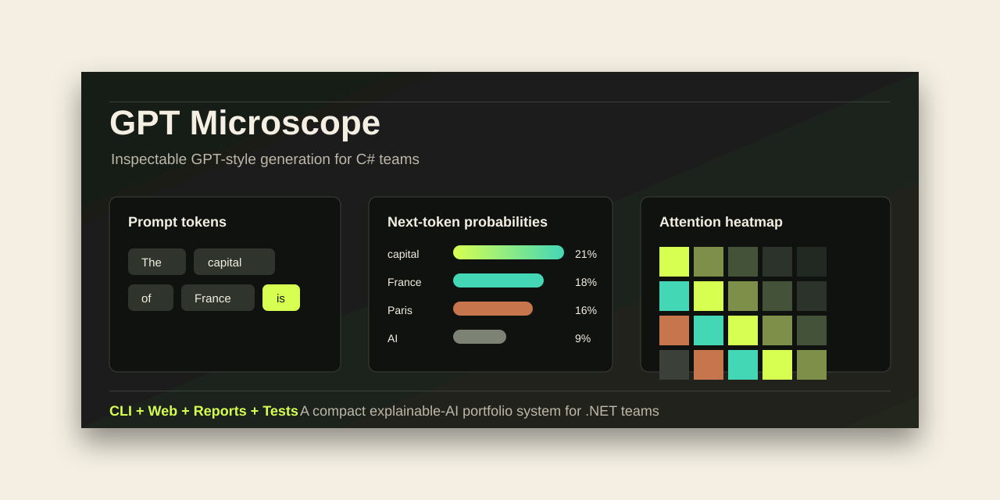
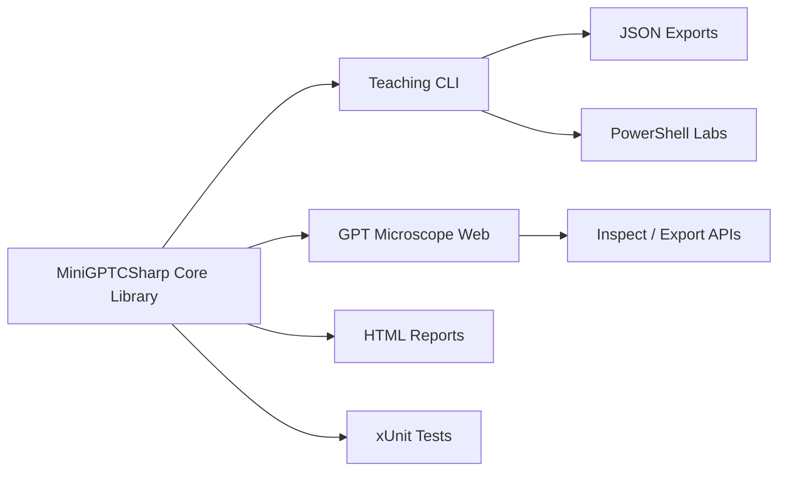

# MiniGPTSharp

[](https://pauljmaddison.github.io/miniGPTCSharp/)




MiniGPTSharp is a polished .NET 8 portfolio demo that makes GPT-style next-token generation inspectable instead of mysterious.

**Value proposition:** a small, credible C# codebase that turns tokenization, logits, softmax, sampling, attention, and ablations into runnable CLI workflows reviewers can evaluate quickly.

**Who it is for:** hiring reviewers, .NET engineers learning LLM fundamentals, and instructors who want a compact 30-minute workshop.

**What it demonstrates:** idiomatic .NET project structure, deterministic model behavior, xUnit regression tests, PowerShell automation, local verification scripts, and documentation that explains the system before anyone runs it.

This repo is deliberately small, inspectable, and a little opinionated:

- it teaches tokenization, logits, softmax, sampling, and attention
- it exposes model internals directly in the CLI
- it includes guided walkthroughs and labs, not just raw code
- it favors readability over realism or performance

It is a toy model, not a production model. That is the point.

## Live Showcase

The repo now includes a static GitHub Pages showcase in [`site`](site). It is designed to be hosted for free from a public GitHub repository and gives clients a polished first impression before they clone anything.

Live showcase:

```text
https://pauljmaddison.github.io/miniGPTCSharp/
```

The static showcase is intentionally frontend-only and is published from the `gh-pages` branch. The full GPT Microscope experience still lives in [`MiniGPTCSharp.Web`](MiniGPTCSharp.Web), where ASP.NET Core serves the live inspection APIs.

## Quick Start

### 1) Build and test

```powershell
dotnet restore .\miniGPTCSharp.sln
dotnet build .\miniGPTCSharp.sln -c Release --no-restore
dotnet test .\MiniGPTCSharp.Tests\MiniGPTCSharp.Tests.csproj -c Release --no-build --no-restore
```

### 2) Try the CLI

```powershell
$cli = ".\MiniGPTCSharp.Cli\MiniGPTCSharp.Cli.csproj"

dotnet run -c Release --project $cli -- --help
dotnet run -c Release --project $cli -- predict --prompt "The capital of France is" --topn 5
dotnet run -c Release --project $cli -- predict --prompt "The capital of France is" --topn 5 --json
dotnet run -c Release --project $cli -- inspect pipeline --prompt "The capital of France is"
dotnet run -c Release --project $cli -- compare sampling --prompt "The capital of France is" --tokens 8
dotnet run -c Release --project $cli -- report --prompt "The capital of France is" --out artifacts/demo-report.html
```

### 3) Run GPT Microscope

```powershell
$web = ".\MiniGPTCSharp.Web\MiniGPTCSharp.Web.csproj"
dotnet run -c Release --project $web --urls http://localhost:5088
```

Then open [http://localhost:5088](http://localhost:5088). The playground runs the existing C# model through ASP.NET Core APIs and renders token IDs, logits, probability bars, attention matrices, generation steps, ablation comparisons, and HTML report export.

### 4) Use the local helper when needed

On locked-down Windows machines, the scripts can redirect .NET and NuGet state into the repo-local `.dotnet` folder:

```powershell
. .\scripts\Use-LocalDotNetEnv.ps1
Initialize-LocalDotNetEnv
Invoke-RepoDotNet -Arguments @("test", ".\MiniGPTCSharp.Tests\MiniGPTCSharp.Tests.csproj", "-c", "Release")
```

## Three-Minute Client Demo

Use this path when you want to show the project quickly to a reviewer, client, or technical stakeholder:

```powershell
dotnet build .\miniGPTCSharp.sln -c Release
powershell -ExecutionPolicy Bypass -File .\scripts\demo-report.ps1
dotnet run -c Release --project .\MiniGPTCSharp.Web\MiniGPTCSharp.Web.csproj --urls http://localhost:5088
```

Then open [http://localhost:5088](http://localhost:5088), run the default prompt, show the generated report in `artifacts\demo-report.html`, and point out that CLI, web, tests, and reports all use the same C# core model.

## Go Deeper

- [CLI command guide](#cli-commands)
- [Recommended teaching flow](#recommended-teaching-flow)
- [Client-facing showcase](docs/showcase.md)
- [Static GitHub Pages showcase](site)
- [Architecture overview](docs/architecture.md)
- [30-minute teaching guide](docs/teaching-guide.md)
- [Contributing and local development](CONTRIBUTING.md)
- [Roadmap](ROADMAP.md)
- [Security and local-first behavior](SECURITY.md)

## Why this repo is useful

Most AI repos make one of two tradeoffs:

- they are realistic, but too large for beginners to follow
- they are simple, but too shallow to build a strong mental model

MiniGPTSharp tries to land in the middle. Students can:

- generate text
- inspect tokens and embedding vectors
- inspect attention weights for the last token
- compare deterministic generation with seeded sampling
- compare the baseline model against ablations like `--no-attention`

That makes it a much better teaching tool than a plain "text in, text out" demo.

## What students should learn here

By the end of a session with this repo, a student should understand:

- text is converted into tokens, then token IDs
- the model works with numbers, not raw strings
- logits are scores for candidate next tokens
- softmax turns logits into probabilities
- deterministic generation follows argmax
- sampling chooses from the probability distribution
- attention changes which earlier tokens matter most
- architecture choices like attention, position, and layer norm affect behavior

## Best Ways To Use This Repo

### Guided walkthrough

For a teacher-led or self-paced walkthrough:

```powershell
powershell -ExecutionPolicy Bypass -File .\scripts\student-walkthrough.ps1
```

This pauses between sections and writes a transcript to `scripts\walkthrough-output.txt` by default.

### Student lab pack

For a shorter "show me the core ideas" lab sequence:

```powershell
powershell -ExecutionPolicy Bypass -File .\scripts\student-labs.ps1
```

This runs five focused labs:

- tokenization
- embeddings
- attention
- sampling comparison
- architecture ablation

### Full regression/smoke checks

```powershell
powershell -ExecutionPolicy Bypass -File .\scripts\smoke.ps1
powershell -ExecutionPolicy Bypass -File .\scripts\test-all.ps1
```

## CLI Commands

### `predict`

Shows the model's next-token belief distribution.

```powershell
dotnet run -c Release --project $cli -- predict --prompt "The capital of France is" --topn 5 --explain
```

Use this to teach:

- logits vs probabilities
- top-N candidates
- why "most likely next token" is not the same as "true answer"

Add `--json` when you want stable machine-readable output:

```powershell
dotnet run -c Release --project $cli -- predict --prompt "The capital of France is" --topn 5 --json
```

### `generate`

Runs the normal autoregressive loop.

```powershell
dotnet run -c Release --project $cli -- generate --prompt "Hello" --tokens 8 --seed 42
dotnet run -c Release --project $cli -- generate --prompt "Hello" --tokens 8 --deterministic
```

Use this to teach:

- deterministic argmax vs sampling
- reproducibility with seeds
- how repeated next-token choice builds a sequence

### `step`

Shows generation one token at a time.

```powershell
dotnet run -c Release --project $cli -- step --prompt "The capital of France is" --tokens 3 --seed 42 --explain --show-logits
```

Use this to teach:

- forward pass
- logits
- softmax
- chosen token
- append and repeat

### `inspect`

The most useful upgrade in this repo. It exposes internals students normally only hear described.

#### `inspect tokens`

```powershell
dotnet run -c Release --project $cli -- inspect tokens --prompt "The capital of France is Paris."
```

Shows:

- token positions
- token texts
- token IDs
- whether a token came from the seeded toy vocabulary or was added at runtime

#### `inspect embeddings`

```powershell
dotnet run -c Release --project $cli -- inspect embeddings --prompt "AI model learning" --layers 0 --dims 8
```

Shows:

- token table
- embedding vector previews

Good for teaching:

- embeddings are numeric representations
- different tokens map to different vector patterns

#### `inspect attention`

```powershell
dotnet run -c Release --project $cli -- inspect attention --prompt "The capital of France is Paris" --attention-topn 5
```

Shows:

- which earlier tokens the final token is attending to
- the top attention targets for each layer

Good for teaching:

- attention is not magic
- the model weights previous tokens differently
- different layers can focus differently

#### `inspect pipeline`

```powershell
dotnet run -c Release --project $cli -- inspect pipeline --prompt "The capital of France is" --dims 6 --attention-topn 5
```

Shows all of the above in one report:

- token table
- embedding preview
- attention summary
- top next-token predictions

This is the best single command to show a student who asks, "What is the model doing right now?"

Each inspection topic also supports `--json`:

```powershell
dotnet run -c Release --project $cli -- inspect pipeline --prompt "The capital of France is" --dims 6 --attention-topn 5 --json
```

The JSON uses camelCase properties and includes a `schemaVersion`, command metadata, prompt tokens, and the topic-specific sections requested by the command.

### `compare`

The second big upgrade in this repo. It lets students compare behaviors instead of memorizing definitions.

#### `compare sampling`

```powershell
dotnet run -c Release --project $cli -- compare sampling --prompt "The capital of France is" --tokens 8
```

Shows side by side:

- top next-token beliefs
- deterministic argmax continuation
- seeded sampling with one seed
- seeded sampling with another seed

Good for teaching:

- `predict` is belief, not choice
- argmax is one path through the distribution
- different seeds produce different sampled paths

#### `compare ablation`

```powershell
dotnet run -c Release --project $cli -- compare ablation --prompt "The capital of France is" --tokens 8
```

Shows side by side:

- baseline model
- no attention
- no position embeddings
- no layer norm

Good for teaching:

- architecture decisions change behavior
- removing a component is a useful learning tool
- "what each part does" becomes visible through comparison

Both comparison modes support `--json` for downstream tools:

```powershell
dotnet run -c Release --project $cli -- compare sampling --prompt "The capital of France is" --tokens 8 --json
dotnet run -c Release --project $cli -- compare ablation --prompt "The capital of France is" --tokens 8 --json
```

### `report`

Generates a polished standalone HTML report with embedded CSS and no external runtime dependency.

```powershell
dotnet run -c Release --project $cli -- report --prompt "The capital of France is" --out artifacts/demo-report.html
```

The report includes:

- prompt summary
- token table
- embedding preview
- attention heatmap by layer
- top next-token probability bars
- deterministic vs seeded sampling comparison
- ablation comparison
- short "what this teaches" notes

You can generate the same demo artifact with:

```powershell
powershell -ExecutionPolicy Bypass -File .\scripts\demo-report.ps1
```

### `learn`

`learn` is a guided entry point that runs curated topics.

```powershell
dotnet run -c Release --project $cli -- learn tokenization
dotnet run -c Release --project $cli -- learn embeddings
dotnet run -c Release --project $cli -- learn attention
dotnet run -c Release --project $cli -- learn sampling
dotnet run -c Release --project $cli -- learn ablation
```

This is useful when students are unsure which command to start with.

## Recommended Teaching Flow

If you have 10-15 minutes:

1. `predict`
2. `step --explain`
3. `compare sampling`

If you have 20-30 minutes:

1. `inspect tokens`
2. `inspect embeddings`
3. `inspect attention`
4. `compare sampling`
5. `compare ablation`

If you are teaching a full beginner session:

1. run `student-walkthrough.ps1`
2. stop after each section and ask what changed
3. use `inspect pipeline` on a student-chosen prompt
4. use `compare ablation` to show why architecture matters

## Mental Models That Work Well

### Predict vs generate

- `predict` = what the model currently believes
- `generate` = how the system chooses from that belief repeatedly

### GPT as autocomplete

The most useful beginner mental model is still:

> GPT is a probability-based next-token autocomplete loop.

That is not the whole story for large real models, but it is the right starting point.

### Why the output can feel "wrong"

If the repo predicts `capital` over `Paris`, that is a teaching opportunity, not a bug.

It shows:

- the model is ranking token continuations
- token probability is not the same as factual reasoning
- output depends on learned patterns in this toy system

## Naming Note

The public repo name is **MiniGPTSharp** because it reads cleanly as a C# teaching demo. The solution, folders, and namespaces use **MiniGPTCSharp** to preserve the original project identity and make the C# language target explicit.

## Project Structure

- [`MiniGPTCSharp`](MiniGPTCSharp) contains the toy model, tokenizer, tensor wrapper, and inspection types
- [`MiniGPTCSharp.Cli`](MiniGPTCSharp.Cli) contains the learning CLI
- [`MiniGPTCSharp.Web`](MiniGPTCSharp.Web) contains the GPT Microscope ASP.NET Core playground
- [`MiniGPTCSharp.Tests`](MiniGPTCSharp.Tests) contains xUnit golden tests and inspection tests
- [`scripts`](scripts) contains walkthrough, lab, smoke, and test scripts
- [`docs`](docs) contains the architecture overview and workshop guide
- [`site`](site) contains the static GitHub Pages showcase



## Visual Assets

Showcase images live in [`docs/assets`](docs/assets). Use this helper to start the web app and capture README/release assets:

```powershell
powershell -ExecutionPolicy Bypass -File .\scripts\capture-showcase-assets.ps1 -KeepServer
```

Recommended assets:

- desktop GPT Microscope screenshot
- mobile GPT Microscope screenshot
- generated report screenshot
- short demo GIF showing prompt inspection and report export

## Local-First Trust Signal

MiniGPTSharp does not send prompts to external model APIs. The toy model, CLI, web app, and report generator all run locally, which makes the repo useful for workshops, internal demos, and AI literacy sessions where repeatability and privacy matter.

See [SECURITY.md](SECURITY.md) for the full local-first note.

## GitHub Pages Hosting

The static showcase source lives in [`site`](site). The public GitHub Pages site is published from the `gh-pages` branch root so it can serve without a build step.

To republish after editing `site`:

```powershell
powershell -ExecutionPolicy Bypass -File .\scripts\publish-pages.ps1 -ConfigurePages
```

Repository settings should use:

- Source: **Deploy from a branch**
- Branch: `gh-pages`
- Folder: `/`

GitHub Pages can host this static site for free from a public repository. It will not run the ASP.NET Core app itself, so use separate app hosting if you want the live backend available on the internet.

## What This Repo Is Not

This repo is not:

- a production LLM runtime
- a realistic training stack
- a benchmark of modern model quality
- a replacement for PyTorch-scale transformer implementations

It is a teaching tool.

That means a good change in this repo is one that makes the internals easier to see, compare, and explain.

## Testing

The xUnit test project checks:

- deterministic golden outputs
- prompt inspection structure
- disabled-attention identity behavior

Run:

```powershell
dotnet test .\MiniGPTCSharp.Tests\MiniGPTCSharp.Tests.csproj -c Release
```

For the full local regression flow, including CLI smoke checks:

```powershell
powershell -ExecutionPolicy Bypass -File .\scripts\test-all.ps1
```

## Repository Topics

Suggested GitHub topics:

- `csharp`
- `dotnet`
- `ai`
- `gpt`
- `llm`
- `education`
- `explainable-ai`
- `visualization`
- `portfolio`

## Roadmap

The next upgrades are tracked in [ROADMAP.md](ROADMAP.md), with an emphasis on screenshots, GIFs, prompt presets, richer attention interactions, replayable generation, and packaging the CLI as a .NET tool.
